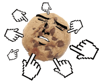

# cookieClicker

# Site en ligne

Acceder au jeu en cliquant ici sur GuitHub (MP3 non pris en charge): [Jeu en ligne](https://elazzouzinordinebecode.github.io/cookieClicker/)  
Sur Netlify avec MP3 pris en charge : [ICI](https://cookie-game.netlify.app/)

## Régles du jeu

Le principe est simple : Générer le plus de cookie possible en cliquant sur le cookie. Plus vous obtenez de cookie, plus vous pouvez acheter de Booster qui vous aide pour avoir encore plus de cookies, plus rapidement. Les booster s'active uniquement si vous avez le crédit suffisant pour les acheter. Ils se désactivent dès l'instant ou votre score chute sous le prix du booster. Pour pimenté le jeu, le prix des boosters augmente à chaque achat.

### Screenshot du jeu

 

### Details des boutons

- Booster X2, X3, X4 : multiplie par 2, 3 et 4 le score.
- Auto-clic : Génère 1 clic automatique toutes les secondes.
- Bonus 200 % : Multiplie par 2 l'ensemble du multiplicateur total.
- Les biscuits en arrière-plan peuvent être drag & drop pour remplacer le biscuit du clic.
- Bouton Restart : permet de relancer le jeu de 0.

### Contributeur

C'est un jeu collaboratif créé en groupe. Donc si vous aimez le jeu et que vous avez trouver de nouvelles fonctions cool a ajouter. N'hésitez pas à nous soumettre vos propositions :

1. Télécharger [Git Bash](https://git-scm.com/downloads).
2. Ouvrez l'emplacement de réception du dossier avec Git Bash.
3. Cloner le repository avec l'instruction suivant :

- **Avec SSH** : `git clone git@github.com:ElazzouziNordineBeCode/cookieClicker.git`
- **Avec HTTPS** : `git clone https://github.com/ElazzouziNordineBeCode/cookieClicker.git`

4. Créer votre propre branche avec : `git branch votre_nom`
5. Éditer le code avec : `code . `
   Deux exemples d'éditeur : [Visual Studio Code](https://code.visualstudio.com/download) - [Brackets](https://brackets.io/)

Ajouter votre amélioration puis envoyez les nous en faisant dans l'ordre :

- `git add .`
- `git commit -m 'new game improvement proposal'`
- `git push origin your_name`

Si votre amélioration est validée, on la publiera, merci de ton aide ;)
Tu est tout simplement :

